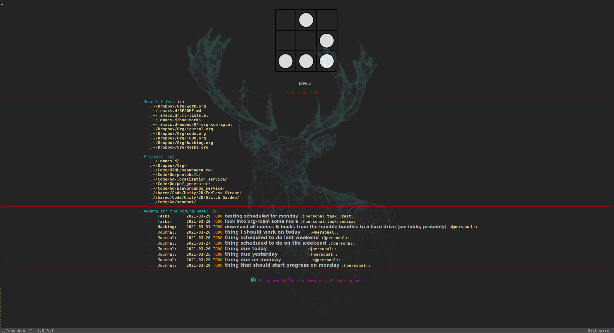

Sean Hagen's Emacs Config
=========================

This is my Emacs config. There are many like it but this one is mine.

I'm always adding or removing stuff, or tweaking bits and pieces.

# NOTES 

A lot of stuff is hard-coded to my own home directory layout, so keep that in
mind if you want to use it.

# SCREENSHOTS

Fun dashboard with [emacs-dashboard](https://github.com/emacs-dashboard/emacs-dashboard)

Clear Org-mode agenda with [org-super-agenda](https://github.com/alphapapa/org-super-agenda)

LSP with auto-completion in Go!

LSP with auto-completion (IN LINUX) for C# (and Unity!)

# CHANGELOG

2021-03-26: Set up repo
